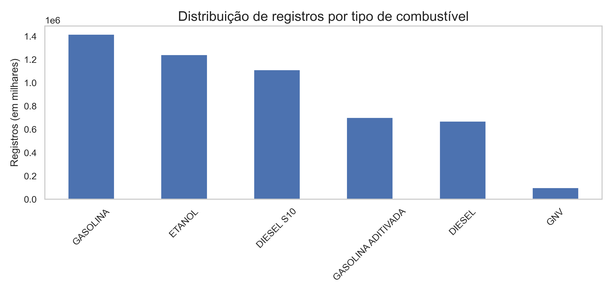

# 📊 Análise dos Preços de Combustíveis no Brasil (2019–2024)

## Descrição

Projeto de análise exploratória de dados públicos divulgados pela ANP sobre os preços de combustíveis automotivos no Brasil, no período de 2019 a 2024.


O objetivo é identificar tendências de preços, variações regionais, influência das bandeiras dos postos e a margem de lucro dos combustíveis.

---

## Tecnologias Utilizadas

- Python (pandas, numpy, matplotlib, seaborn)
- Jupyter Notebook
- Dados públicos da ANP
- Visualização de dados

## Estrutura do Projeto

```
/dados/      → Arquivos CSV utilizados
/imagens/    → Gráficos salvos (.png)
/notebooks/  → Notebook de análise
README.md    → Documentação do projeto
```

## Etapas do Projeto

- Coleta e consolidação de dados de mais de 20 arquivos CSV
- Limpeza e padronização dos dados
- Análise exploratória:
    - de produtos;
    - de regiões; e
    - de bandeiras
- Análise econômica da margem de lucro
- Visualização gráfica dos resultados

## Principais Resultados

### 🔹 Distribuição dos Combustíveis


---

### 🔹 Evolução dos Preços Médios (2019–2024)


---

### 🔹 Comparativo Regional de Preços


---

### 🔹 Margem de Lucro Média por Tipo de Combustível


---

## Conclusões

A análise dos dados de preços de combustíveis no Brasil entre 2019 e 2024 revelou padrões interessantes de comportamento de mercado:

- A gasolina comum foi o combustível mais vendido e impactou fortemente a média de preços nacional.
- Durante a pandemia (2020–2022), o Diesel sofreu o maior aumento percentual de preço.
- A região Sudeste apresentou a maior distribuição de combustíveis e também preços mais elevados.
- Os postos de bandeira branca dominam em número, mas não necessariamente praticam os maiores preços.
- Até 2020, o GNV se destacou como o combustível com a maior margem de lucro média.

## Lições Aprendidas

- Análise e tratamento de dados públicos reais
- Tomada de decisão baseada em dados incompletos (gestão de dados faltantes)
- Visualização e interpretação crítica de informações econômicas
